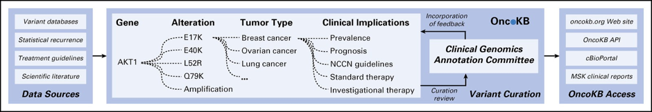
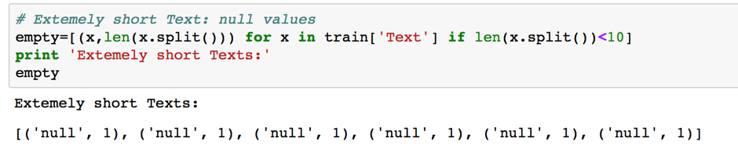
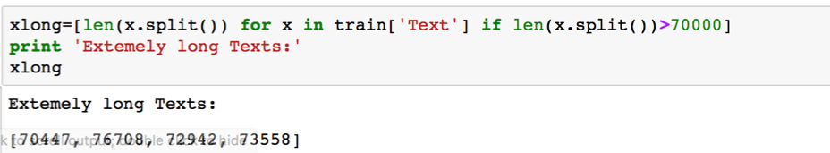
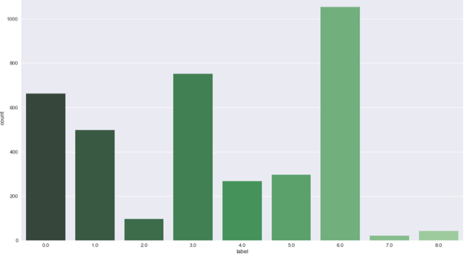
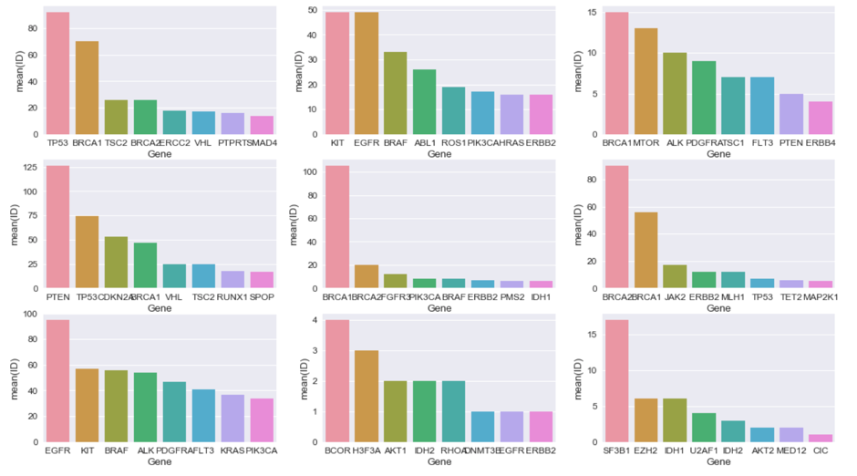
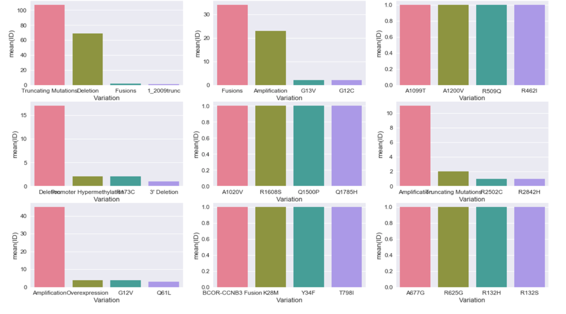
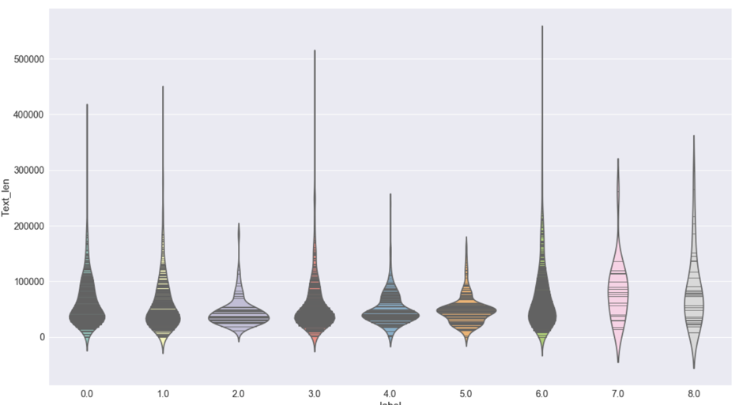
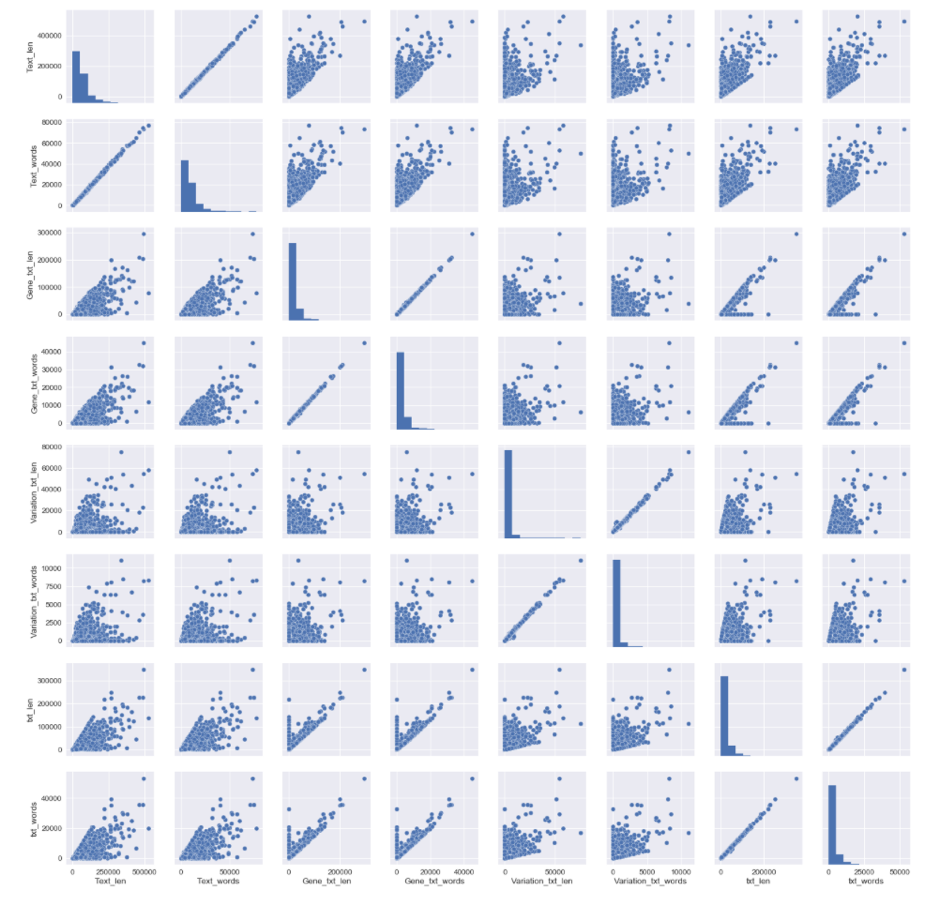
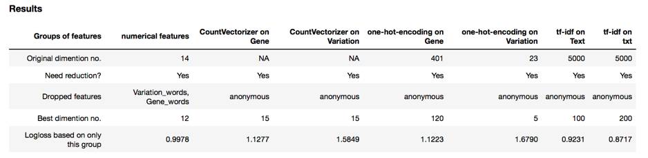
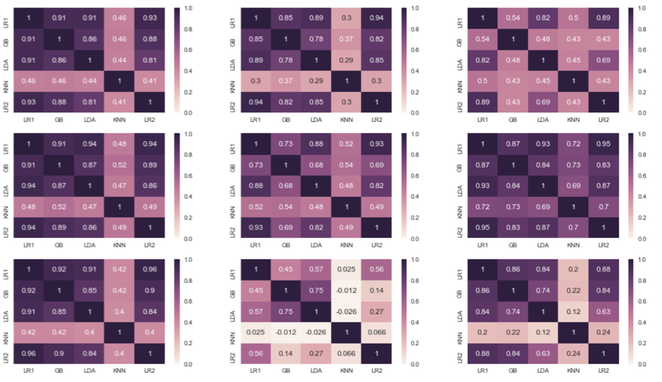

### Overview
The host, Memorial Sloan Kettering Cancer Center (MSKCC), has been maintaining the database OncoKB for the purpose of knowledge sharing of mutation effects among oncologist. Currently this interpretation of genetic mutations is being done manually. This is a very time-consuming task where a clinical pathologist has to manually review and classify every single genetic mutation based on evidence from text-based clinical literature. And due to my combined interest in biology and data science, I am interested in using my expertise to develop a machine learning algorithm that, using an expert-annotated knowledge base as a baseline, automatically classifies genetic variations.

This is my very first competition since I started my journey of data science the middle of last year. And it has become a unforgetful fast learning experience for me. The rigorious background research, heated forum discussions, sometimes unpredictable model responses, and  the hectic and exhuasting feature engineering implementations, have altoghether given me a read taste of the machine learning implementation on an actual need. The competition ends at October 2nd, 2017. I am very happy to see the top 5% scores in my novice trial as reward of the hardwork I have put. If you are interested, you can check my `Code-kaggle's personalized medicine competition.ipynb` for more details about the solution.

I found it’s rather interesting to see how machine learning can help in routine biological study. Actually, there are tons of repetitive work in a junior researcher’s career. For me, as my project is using biophysical method to study the structural and functional characteristics of a pathological protein, I am exposed to lots of NMR data every day. It always takes weeks or even months to manually assign amino acid fingerprint son HSQC to its primary structure by comparing their chemical shift with empirical values, which is totally boring and mechanic. Therefore, I am very interested in applying my knowledge and skills I learned here to change this situation.

**Note:**
- The mentioned kaggle competition is [here](https://www.kaggle.com/c/msk-redefining-cancer-treatment).
- All the files mentioned could be found in `data` folder or accessed [here](https://www.kaggle.com/c/msk-redefining-cancer-treatment/data).  
- My kaggle profile is [here](https://www.kaggle.com/lu1993).

### Software and Libararies
- [Python 2.7](https://www.python.org/download/releases/2.7/)
- [NumPy](http://www.numpy.org/)
- [pandas](http://pandas.pydata.org/)
- [scikit-learn](http://scikit-learn.org/stable/)
- [matplotlib](http://matplotlib.org/)
- [Seaborn](https://seaborn.pydata.org)
- [Gensim (word2vec)](https://radimrehurek.com/gensim/)
- [XGBOOST](https://xgboost.readthedocs.io/en/latest/)
- [Entrez-biopython](http://biopython.org/DIST/docs/api/Bio.Entrez-module.html)

### Skills Used:
- Research and investigate a real-world problem of interest.
- Accurately apply specific machine learning algorithms and techniques.
- Properly analyze and visualize your data and results for validity.
- Quickly pick up unfamiliar libraries and techniques.
- Prioritize and implement numerous of ideas and hypothesis.
- Document and write a structed report.

## Capstone Project for Machine Learning Engineer Nanodegree

# Kaggle's Personalized Medicine Competition

**Part I. Proposal**

### Project Overview

A lot has been said during the past several years about how precision
medicine and, more concretely, how genetic testing is going to disrupt
the way diseases like cancer are treated. But this is only partially
happening due to the huge amount of manual work still required. Once
sequenced, a cancer tumor can have thousands of genetic mutations. But
the challenge is distinguishing the mutations that contribute to tumor
growth (drivers) from the neutral mutations (passengers). The host,
Memorial Sloan Kettering Cancer Center (MSKCC)

, has been maintaining the database OncoKB \[1\] for the purpose of
knowledge sharing of mutation effects among oncologist. Currently this
interpretation of genetic mutations is being done manually. This is a
very time-consuming task where a clinical pathologist has to manually
review and classify every single genetic mutation based on evidence from
text-based clinical literature.  Therefore, the task is to develop a
Machine Learning algorithm that, using an expert-annotated knowledge
base as a baseline, automatically classifies genetic variations.

Since 2004 there are consequent publications trying to address this
problem by developing automatic computational methods, and achieved
encouraging results, such as CHASM
(**C**ancer-specific **H**igh-throughput **A**nnotation
of **S**omatic **M**utations) \[2,3\] (led by Carter et al., published
on Cancer Res and Gene Function Analysis respectively), and FIS
(Functional Impact Score) \[4\] (leb by scientists in Computational
Biology center, MSK). However, all of these methods requiring strong
domain knowledge and high sensitivity to pattern such as protein first
and secondary structure characteristics or evolutionary conservation
features, while take little use of literature on clinical impacts or
pathological mechanism of that variant. On the other hand, the natural
language processing tools \[5,6,7\] in cancer study focus mainly on
identifier detection and concepts locating, which are not shrewd enough
to predict the functional consequences of a mutant. A NLP based
automation method which is able to annotate the functional impact of
variants of intense research interest is much needed.

As stated before, variants in those datasets are from real-world cancer
cell sequencing, all annotations (labels) are manually added by
oncologists based on clinical or molecular studies on the corresponding
variant. Text information annotated to each variant are also hand-picked
by those domain experts. Given gene AKT1, variant E17K, their workflow
according to their official website \[1\] is like this:

. 

**Details of input datasets: **

-   training\_variants - a comma separated file containing the
    description of the genetic mutations used for training. Fields
    are ID (the id of the row used to link the mutation to the clinical
    evidence), Gene (the gene where this genetic mutation is
    located), Variation (the aminoacid change for this
    mutations), Class (1-9 the class this genetic mutation has been
    classified on)

-   training\_text - a double pipe (||) delimited file that contains the
    clinical evidence (text) used to classify genetic mutations. Fields
    are ID (the id of the row used to link the clinical evidence to the
    genetic mutation), Text (the clinical evidence used to classify the
    genetic mutation)

-   test\_variants - a comma separated file containing the description
    of the genetic mutations used for training. Fields are ID (the id of
    the row used to link the mutation to the clinical
    evidence), Gene (the gene where this genetic mutation is
    located), Variation (the aminoacid change for this mutations)

-   test\_text - a double pipe (||) delimited file that contains the
    clinical evidence (text) used to classify genetic mutations. Fields
    are ID (the id of the row used to link the clinical evidence to the
    genetic mutation), Text (the clinical evidence used to classify the
    genetic mutation)

-   submissionSample - a sample submission file in the correct format

(Notice that the files above are for stage 1 competition, stage 2
competition has added [5 more
files](https://www.kaggle.com/c/msk-redefining-cancer-treatment/data))

### Problem Statement

According to the host, they want algorithms to classify genetic
mutations based on clinical evidence (text). There are nine different
classes a genetic mutation can be classified on. This is not a trivial
task since interpreting clinical evidence is very challenging even for
human specialists. Therefore, modeling the clinical evidence (text) will
be critical for the success of final approach. Both, training and test,
data sets are provided via two different files. One
(training/test\_variants) provides the information about the genetic
mutations, whereas the other (training/test\_text) provides the clinical
evidence (text) that our human experts used to classify the genetic
mutations. Both are linked via the ID field. Therefore, the genetic
mutation (row) with ID=15 in the file training\_variants, was classified
using the clinical evidence (text) from the row with ID=15 in the file
training\_text. Noticebly, the host explicitly mentioned there were
machine-generated data to prevent hand labeling. Participants will
submit all the results of the classification algorithm develop, but they
will ignore the machine-generated samples. 

For this natural language based multi classification problem, the two
key problems would be: firstly, how to extract most useful features for
later model training; and secondly, how to find the most suitable
algorithm for that extracted features. To best capture effective
features, I need to have deeper understanding of the problem and
datasets by asking myself questions such as: what the 9 anonymized
labels actually mean? What’s the biological relationship of these
catagories? Why those papers instead of others, stand out as basis of
classification? What are the characteristics of narratives in papers
that most convince oncologists in classification? How to reduce the
noise and maximize signal-to-noise ratio in text? Then, to find the most
suitable algorithms, I should know how big the datasets are and what’s
the relationship within features. For this specific problem, since each
data point is one cancer-related variant, our input are relatively small
datasets. While since most features are extracted from text by
vectorizer such as bag of words, tfidf etc, I would expect lots of
features. I would try Logistic Regression, Decision Trees, Gradient
Boosting, Linear SVM and xgb for this problem, and use log loss for
evaluating the performance of my models. (AUC should also work for
classification problem here but since log loss is taken by host to
calculate rankings I would use only log loss for optimizing the method)

### Evaluation Metrics

For this competition, the evaluation metric used is [Logarithmic
Loss](https://www.kaggle.com/wiki/LogarithmicLoss) metric. Each
observation is in one class and for each observation, there should be a
predicted probability for each class. The metric is negative the log
likelihood of the model that says each test observation is chosen
independently from a distribution that places the submitted probability
mass on the corresponding class, for each observation.

logloss=−1N∑i=1N∑j=1Myi,jlog(pi,j)logloss=−1N∑i=1N∑j=1Myi,jlog⁡(pi,j)

where N is the number of observations, M is the number of class
labels, loglog is the natural logarithm, yi,jyi,j is 1 if
observation ii is in class jj and 0 otherwise, and pi,jpi,j is the
predicted probability that observation ii is in class jj.

Both the solution file and the submission file are CSV's where each row
corresponds to one observation, and each column corresponds to a class.
The solution has 1's and 0's (exactly one "1" in each row), while the
submission consists of predicted probabilities.

The submitted probabilities need not sum to 1, because they will be
rescaled (each is divided by the sum) so that they do before evaluation.

(Note: the actual submitted predicted probabilities are replaced
with max(min(p,1−10−15),10−15) max (min(p,1−10−15),10−15).)

**JUSTIFICATION:** Log loss is based on information theory, in which it
stands for the cross entropy between the actual labels and predictions.
It’s used to measure the accuracy of classification, but instead of
measuring based on only the predicted most likely class, it measures the
calculated probability of each candidate class. Back to this
competition, the sample submission is asked to include 9 values for each
testing point, which are the predicted confidence of that class to be
the actual label. Log loss is a very good choice of metric under this
situation.

### References for proposal

\[1\] *OncoKB: A Precision Oncology Knowledge Base*

\[2\] *Cancer-specific High-throughput Annotation of Somatic Mutations:
computational prediction of driver missense mutations*

\[3\] *Predicting the Functional Consequences of Somatic Missense
Mutations Found in Tumors*

\[4\] *Predicting the functional impact of protein mutations:
application to cancer genomic*

\[5\] *tmVar: A text mining approach for extracting sequence variants in
biomedical literature*

\[6\] *TaggerOne: Joint Named Entity Recognition and Normalization with
Semi-Markov Models*

\[7\] *GNormPlus: An Integrative Approach for Tagging Gene, Gene Family
and Protein Domain*

**Part II. Analysis**

### 1.1 Data Exploration

Since the competition is divided into 2 stages, the solution of stage
one competition towards stage one test set can be added to training
dataset to increase statistic power, I merged \`training labels\` and
\`stage1\_solution\` as final labels \`y\`; merge \`stage2\_test,
stage2\_text\` into variable \`test\`, and merge \`filtered solution.ID,
training\_ text, training\_variants, test\_test, test\_text\` into
variable \`train\`. (Basically, I will do both model training and cross
validation on \`train\`. \`test\` would only be used for leading board
submission.) The input \`train\` variable has only 3 fields: \`Gene\`,
\`Variation\`, and \`Text\`. There are in total 401 unique genes and
3921 unique variations for 4675 entries, with the top gene appearing 322
times) and top variation 129 times. Unsurprisingly, some familiar cancer
related genes appear in its Gene field: such as BRCA1, the most infamous
factor in breast cancer of white women, and PTEN in prostate cancer of
men.

In case of non-biology background readers: \`Gene\` is the unit of DNA.
And human DNA are composed of more than 20K of such functional units,
each carries special genetic markers that we usually call SNP (Single
Nucleotide Polymorphism). SNP is usually harmless, but when it disrupts
some key cell signaling pathway it can lead severe consequences as well.
Wild type gene is the one with the standard gene sequence which is
stored in human gene bank and used as reference when conducting
sequencing. Any gene that differs from the reference sequence is taken
as a \`Variation\` (or mutant). If this is a point mutantation, the
first alphabet would be the amino acid which this variation change from
wild type one, and the last alphabet means the amino acid it changes to.
Taking entry 2: Gene CBL, variation Q249E as an example. This entry
means the 249 amino acide of gene CBL is mutated from Glutamine (Q) to
Glutamic acid (E). You will also find different forms of Variation such
as Amplification, Truncation, Epigenetic Silencing and so on. But I
cannot elaborate more on them since it would involve deep understanding
of epigenetic regulation, which goes beyond the scope of this paper. The
readers only need to know that they are simply different variations from
wild type form of that corresponding gene.

The \`Text\` field of each entry is handpicked by domain expert as key
literature evidence of classification. A simple googling discovers that
they are all from PubMed papers concerning the gene or variation.
However, some of them are combined from multiple papers, and some of
them are only one single paper and a few of them are just empty (their
\`Text\` field are indicated by \`null\`). Like this:

 While these
extremely long texts could be as long as 73558 words with the median
value to be 6895 words!

I can’t figure out the reason why their oncologists do that. But these
**extreme long or short texts** would potentially affect later
processing and modeling. And also, I noticed the distribution of 9
classes is very **imbalanced. **

Weight of Each Class

**Fig 1.**

### 1.2 Exploratory Visualization**

Since there are too few variables in input data and none of them are
numerical. I created some numerical variables from original categorical
variables by feature engineering. After initial visualization of each
variable, I proceed to look at the correlation of them against Class,
which would provide important insights for modelling. Here only
bivariate analysis is included in this report.

**-1. Most Frequent Genes and Class**

Bivariate: 8 Top frequent genes for each class

**Fig 2.**

First of all, the distribution of gene frequency varies a lot, such as
for class 1, TP53 and BRCA1 are much more frequent than other genes.
Likewise, top few genes take up a big percentage in class 5, class 6 and
class 9, indicated by the great gap of frequency between the top 1 gene
and the top 10 gene. While the gene distribution seems more balanced in
class 2, class 3 and class 7. Secondly, the most representative group of
genes are distinctively different for each class. The most appearing
gene for 9 classes are TP53, KIT, BRCA1, PTEN, BRCA1, BRCA2, EGFR, BCOR
and SF3B1 respectively, with the only overlap from class 3 and class 6.
But once look closer, the two have not only very different combination
of first-tier genes but also the distribution of them. In sum, Gene
looks like a very promising predictive factor for the label.

**-2. Most Frequent Variations and Class**

Bivariate: 4 top frequent variations for each class

\#\# Bivariate: text lengh versus class

**Fig 3.**

Noticeably, variations are much more diverse and the frequency of the
top variation is much lower than the top gene. This is because we have
only limited number of genes (around 20,000 for human beings, among
which only less than 10% are cancer related), but almost unlimited
possibility of the number of variations. (As we have discussed before, a
variation is basically a form of gene which is different from wild type
gene. For a specific gene, even assuming it is composed of only 500
amino acids, the possible point mutations only could be as many as
500\*20, not to say deletions, insertions and many other forms of
variation.)

Some classes like as class 3, class 4 and class 9 even don’t have a
single repeated variation, indicated by the top frequent one having only
1 count. I also want to point out that the top variations in other
classes, such as truncating mutations in class 1, deletion in class 4
and amplification in class 7, are actually aggregated form of mutations,
meaning themselves do not refer to any specific variation, unlike
A1099T, a point mutation which specifically refers to a point mutation
from Ala to Thr in 1099 position of this gene, truncating mutations and
deletions is a joint name in their cases. Therefore, even Variation also
shows some correlation towards Class, I would expect it has less
predicting power than Gene does.

**-3. Text Length Distribution and Class**

Bivariate: Text length distribution for each class

**Fig 4.**

\`Text\_len\` is a variable created by encoding the character length of
Text field. Surprisingly, the distributions of text length are very
heterogeneous. Class 3 (label 2.0), for example, has a very narrow
distribution, in which almost 95 percent of its text are in range (20K,
80K). In contrast class 8 and class 9 have expanded text length
distribution, indicated by the long and narrow spindle shape. Text
length also looks like a promising feature for forecasting the class.

### 1.3 Algorithms and Techniques

I will heavily need pandas, numpy and sklearn libraries and sometimes I
need sns to show correlation or feature importance. Since the inputs are
separated in 4 files I will combine them and handle it as one file.
Primary features are only 3*:* Gene, Variation and Text. For the first
two I will implement one-hot-encoding, label encoding, bag of words
extraction, encoding length and all (basically as much engineering as I
can think of). For Text I will consider more complex way to treat it
such word-embedding, topic modeling and tfidf vectorising. But how to
improve signal to noise ratio would be major concern. Preprocessing
seemingly not necessary here, as most of data are counts, frequency. But
it is to be confirmed.

Condering I will need to try different combinations of: ways to engineer
features, extract features (tfidf,bow, word2vec,doc2vec,LDA), features
selection (PCA, SVD), algorithms (logistic regression, SVM,
DecsionTress, GradientBoosting, KNearestNeighbors,
LinearDiscriminantAnalysis, XGB), parameters of algorithms etc., I need
to build a *pipeline* gives flexibility to try all this. And an
automation method GridSearchCV to reduce repeated work of
hyper-parameters tuning.

Once I get a few good performing models, I will need to ensemble them
for a better solution, by methods such as blending, stacking, bagging.
It will be a trade-off that whether using strong performers but less
number of ensembling, or weaker performers but greater size is better
strategy. And balance the complexity with robustness of the model over
unseen data.

**JUSTIFICATION:** if you have noticed, I have tried and used quite a
lot of techniques. That’s because in the process of Kaggle, the problem
to be addressed is so complicated and the competition is so hectic that
it is impossible for participants to foresee which algorithms would work
well before actually implementing them. Such as **KNN** is known as a
lazy learner which doesn’t summarize data much and takes a lot of
computation on high dimensional data. It indeed did quite badly (worse
than uniform guess), however, taking it out from base estimators
unexpectedly weakened the ensemble model. Another example is **SVM**, it
looks like a perfect algorithm for this problem in many aspects: the
problem is high dimensional text classification; SVM’s kernel trick
allows expert knowledge via engineering; its maximizes the margin to
make the model more robust … however it’s not taken in final solution
since somehow too much computation time required by it. Third example is
**Logistic Regression**, it is known of being vulnerable to dependent
input data as well as outliers. As we found out in visualization part,
linear correlations are very common among these engineered numerical
variables (fig. 5) and the Text field has quite some extremely short or
long texts (fig. 4). However, in practice it works well. And more
surprisingly, it gives high weight of importance to even related
features. And removing any of them weakens its performance.

Considering both the complexity and the workload, I cannot elaborate on
each of the algorithms I used and justify their suitability. In fact,
some algorithms are chosen not because of their theoretical suitability
but their appearance actually improved the model. But I do have reasons
on the two key techniques about why I use them for this dataset and why
they are suitable. **1. TFIDF**: Tf-idf is the finalized text feature
extraction method, which is short for term frequency–inverse document
frequency, value of which is intended to reflect how important a word is
to a document in a corpus. Since it ignores the position and semantics
information it is easy to compute and very straightforward. As we have
discussed in data visualization, the top frequent gene and variation
names are distinct for each class, which are basically counts of
specific words. These findings indicate tf-idf would works well for our
problem and it indeed is. **2. XGB**: XGB is a great implementation of a
scalable tree-boosting method. It doesn’t have independent assumption on
input data like LR and it is known to be robust to noise in real-world
data as tree algorithm. Besides, it allows users to customize metric
function for watchlist and automatically generate the best iteration.
(In fact, it has become a rock star in kaggle’s winning solutions.) Due
to the 3 points I mentioned, XGB is great in predicting as a single
model and even greater as a generalizer of the ensemble model.

### 1.4 Benchmark

For benchmark model, I use gene-encoding features only based on the
consensus that variants from same gene should have more related
behaviours than those not in terms of functional consequences. According
to the formula of metric the host uses for evaluation, the best score is
0.00, meaning 100% hit. The worst possible score is 34.26246 since the
host had added a smoothing transformation. Score can be easily improved
to 2.1 by simply throwing uniform guesses and it will keep climbing to
1.8 once weights of each class considered. I want to know how much it
can improve with only addition of gene one-hot-encoding information.
After running Logistic Regression on 1022 gene one-hot encoding
features, I got an average score of 1.21216637352 from 5-fold validation
without tuning. This gives the baseline from where the text features
should start with.

### 2.1 Data Pre-processing

(Feature selection and feature transformation will be discussed in
Implementation part. Here I will mainly talk about feature engineering
and encoding.) As I have mentioned before, due to the nature of this
competition being natural language processing, I have only 3 input
variables and none of them are numerical, with Text being the richest in
information. And I discovered in explorative analysis that the text
length distribution is actually characteristic of each class. Therefore,
the first thing I do is creating new features regarding Text length.
It’s a bit tricky about how to encode this information though. Words
length is more instinctive than character length as it’s widely accepted
as the unit of text instead of alphabet. However, word is bigger grain
compared with character and the transformation from character to word
itself is basically distortion of original input and potentially
vulnerable of information loss. Actually, scientific papers use even
richer punctuations to secure accuracy in narrative compared to every
day text. In the end, I took both of the two ways in encoding, leave the
option to the model itself.

Besides, as I have mentioned in the proposal：figuring out how these
papers are selected and by what way the signal-to-noise ration can be
improved before feeding materials to model might be the key factor in
deciding the quality of model. Although the median length of text is as
long as nearly 7,000 words, most of them are totally unrelated to the
ultimate question we want to answer. After manual check of few texts, I
realized the sentences that carry the corresponding Gene or Variation
names are more likely to contain the hints of classification. Therefore,
I create Gene\_txt\_len, Gene\_txt\_words and Variation\_txt\_len,
Variation\_txt\_words, with each stand for the word length or charater
length of sentences containing that Gene or Variation. And of course, I
also created another field named \`txt\`, which unlike original Text,
has only joint sentences carrying Gene or Variation names. For some
entries of which their Text fields don’t contain any of such sentences,
I simply fill then with Text. A problem occurred during this process is
the inconsistency of naming. Such as gene CCNC could be mentioned in
standard form, but cyclin C, or CycC, even hSRB11or SRB11 could also
refer to the same gene. I tried to find a tagging tool to tag different
names of the same identity to the standard reference number but no
current annotation tools accept direct text input (most accept only
PMID) and give the expected outcome. I spent quite some time to conquer
the first bottleneck， but in the end, I didn’t use it for final model
due to both time limits and the poor quality of results. I checked the
dependence between new numerical variables, and the results are like
this:

Bivariate: Pairplot of numerical variables

**Fig 5.**

Word length and character length of the same text are highly linearly
correlated. While those of extracted text also shows some linear
relationship with the original ones, they are much weaker, which means
we successfully introduce a new dimension of variance!

I also did label encoding and one-hot encoding on Gene and Variation.
That’s because I expect rich information from Gene based on Gene vs
Class visualization and since I am not sure which way is a better use of
that, I’d better take both and believe the model would take whatever it
wants. However, 2 ways of encoding on Variations are perhaps not that
worthwhile. I decide to give it a try though. Noticeably, due to the
much diversity variation has, I have to aggregate them so that I can
have reasonable dimensions of feature after one-hot encoding, by
labelling all point mutations as SNP, \`\*\` as null, and such.

### 2.2 Implementation and Refinement

Feature selection and extraction process is more like a trial and error
for me. And depend on what algorithm to choose, the ideal input could be
different. For example, I have various text length features which are
linearly correlated with each other as have been shown in the pairplot
of last section. Linear Regression perhaps hate them, but tree-based
algorithm might love it. Besides I have a couple of ideas about how to
vecterize Text variable. To ease the exploration, I build a pipeline for
feature selection, reduction and extraction like the one below, which is
inspired by [the1owl’s
kernel](https://www.kaggle.com/the1owl/redefining-treatment-0-57456) :

The first sub-pipeline \`standard\` will take care of all numerical
values; \`pi1\` and \`pi2\` use CountVecterizer to extract Gene and
Variation name features and share one dimension reduction function
truncatedSVD; \`pi21\` and \`pi22\` for dealing with one-hot-encoding of
Gene and Variation names, but each has a feature reduction function;
\`pi31\` and \`pi32\` are both for extracting and selecting text
extracted features by Tf-dif vectorizer and truncatedSVD, except that
one from Text, one from \`txt\`. This allows me to easily test my
hypothesis by looking at the individual effect of different groups of
variables and trying different combinations of available features. Using
non-optimized logistic regression as tentative model, the preliminary
results are summarised as below:

As expected, algorithm using any group of features alone can give better
score than naïve uniform weighted guess that I mentioned in benchmark
model part (logloss score = 1.8). However, different groups of features
do vary in predicting power. Consistent with explorative visualization,
features extracted from variation almost always perform worse than that
from gene, as clearly shown by CounterVectorizer (1.1277 versus 1.5849)
and one-hot-encoding features (1.1223 versus 1.6790). And surprisingly,
tf-idf built on txt, the feature that we engineered by extracting only
sentences with target names, performs even better than that on Text, the
original feature. Moreover, it takes less than one fifth of the
computational time than Text. Therefore, I decide to use the
12+15+15+120+5+0+200=367 features for further exploration.

Actually, for vectorization of Text I have also tried word-embeding
method such as word2vec and LDA (LatentDirichletAllocation). However,
the biggest problem of using word2vec is the text length. Although
word2vec is doing excellently in short text queries, the limit of words
is usually within 15. Beyond this length, the key characteristics of the
averaged text vector will get averaged and blurred out. The only way out
would be compressing the long text into some short sentence which is
most representative for this paper or most useful in classification. I
tried two ways: one is trying to find the title for each text and use
the title as query to compute the vector for each entry; another is
simply using the first sentence that contain the Gene or Variation name,
and hopefully it indicates something about classification. However,
neither of the two works. For the first one, because the titles of
selected papers are removed for anonymization, I have to find their
title the other way. Even though I successfully accessed PubMed by their
python supportable API entrez, and auto storing titles by querying the
first few words in their database but the returned results is
unpredictable: sometimes it returns None when you can actually find the
paper by manual searching, and sometimes returns a sequence of
candidates. And what’s even worse is, when I managed to collect these
titles and feed them to both pre-trained or locally trained word2vec
model, the results are pretty bad. Even the best is only 1.5. This means
title itself lacks information for guiding classification. And the same
thing happened when I use the first sentence in txt to build word2vec
features. I guess there are basically too much noise in this process. As
I said before, lots of Text fields are composed of more than one papers,
but both methods take only the first paper into account and not to say
the many missing values, and dirty characters in it. I have also tried
top-based modelling, but unfortunately the preliminary results are too
far away from what I want, so I didn’t proceed for glove or t-SNE.
Finally, I decided to step back to tf-idf vectorization due to time
limitation before competition deadline.

With the 367 features I selected, Logistic Regression with a little
tuning (C=3) gives 1.05 log loss score from 5-fold validation, which is
a major improvement by 0.16 from the benchmark 1.212. And when I change
the penalty from default l2 (ridge) to l1 (lasso), which is designed to
better handle sparse features, the score is improved to 0.9569! The
first time for loss goes below 1. After that logistic regression didn’t
improve however I changed the parameters combination. For the final
model, I decide to use XGB instead of logistic regression since XGB is
robust, powerful and very fast. And unlike LR, it’s quite resilient to
linearly dependent variables. The default XGB gives comparably good
results as the best performing LR model. And after tuning, it climbed to
0.8280, another major improvement from 0.9569. Till now I have improved
0.4 from the benchmark model. I did try to use feature importance of
this tree-based model to select suitable features for xgb. But it turns
out quite to be consistent with that for LR (that’s a surprise to me),
that’s to say adding any extra features besides the 367 reduces the
model performance; and reducing of any current features lowers the
performance. So now I am happy with the 367 features at hand.

Ensemble is carried after chosen the upper layer model. It’s out of the
consideration that by pooling together ideas by diverse base estimators,
the ultimate model would have become more resistant to random error and
algorithm-inherent bias, thus can generalize better on the same data. It
is a common practice among Kagglers and usually the last step of model
generation. I did this mainly to reduce the risk of overfitting and
bias. But before the actual ensemble, it’s necessary to choose a bunch
of base estimators upon which the generalizer would be built. They
should perform fairly well individually but at the same time as
different from each other as possible. I tried Logistic Regression,
KNeighersClassifier, LinearDiscriminantAnalysis, and
GradientBoostingClassifier with different parameters. LR and
GradientBoosting always did the best among all the base estimators
regardless of various parameters. LDA did fair job. But performance of
KNN isn’t that good. I wanted to try SVM, but seems the dimensions of
data and its sparsity just overwhelmed it, I cannot get results with
reasonable time so it’s dropped.

Performance and diversity is a trade-off in the case of ensemble, as the
top performing models are always similar, and sometimes you have to
comprise on one model’s performance due to the different opinion and
perspective it brings to the group. The prediction correlation of the 5
classifiers against 9 classes can be found be the graph below:

Correlation Heat Map of 9 Classes

**Fig 6.**

You can see KNN disagrees with others most of the time. And it seems
estimators have formed consensus for deciding class6, but many
controversial for class 3 and 8. I used predictions of these 6 base
models as meta-input for the top-level generalizer, and formed a model
with average local cross validation score to be 0.805329545758 but
having a high STD of 0.05508. The performance of this model is highly
dependent on the dataset. Such as it predicted quite bad than usual in
one of 5 folds, with log loss as high as 0.88, but did awesomely in
another fold, and got a lowest ever log-loss score, 0.73. In sum,
although not very stable, this model has great potential in performance
and might give surprises under some situations. That’s why I chose it as
one of the two final submissions for this competition.

The second model I choose is the one with most consistently excellent
performance across folds. (Mean of log loss score: 0.79839, STD of log
loss score, 0.01763). I made this on 4 LR base estimators, 5 GB
estimators and one XGB, one LDA, one KNN estimator, in total 12. Due to
the high consistency regardless of folds, I expected it to be very
dependent and stable, and would perform fair under reasonably
disadvantageous situation.

In sum, I can say with confidence that the final model has improved at
least by 0.4142 from benchmark model, and is potential to improve
another 0.06 on some dataset.

### 3.1 Model Evaluation and Validation

The 2 final models both perform fairly well, and fined tuned with most
appropriated hyper parameters. I have checked the model based on
different splitting methods, and also tried different random states for
StratifiedShuffleSplit to find the one that can split the dataset most
evenly. Choice of random state is not a trivial for this case. As you
can easily discover that the entries are not randomly ordered but
instead aggregated by some rule. Since variations of the same gene all
cluster together. It turns out for random\_state=1, the splitting is
quite uneven for the specific dataset, as shown by the big STD of log
loss scores across folds of almost all classifiers (XGB, LR and GB,
etc). While when it was set to 3, the performance of these classifiers
consistently improved. Thus, I fix this parameter as 3 for
StratifiedShuffleSplit in all the later analysis, to avoid fluctuation
of dataset splitting so that it can generalize better on unseen data.

Besides, since I calculated the mean score along with the standard
deviation, I have clear idea of the model with regards to its
robustness. Small perturbations such as how the dataset is splitted
affect my second model very limitedly, as indicated by the small
variance it has in different situation. It does affect my first model
much more, but that’s because I intentionally look for model owning this
feature which gives it potential of supernormal performance. In sum, the
results are very trustable.

### 3.2 Justification

The final results are much stronger than the benchmark result. And I
have thoroughly analysed and discussed about the final solution. Since
Kaggle allows two submissions for final grading and the one with higher
grading would be automatically selected to decide your ranking, I decide
to take a combined strategy by choosing one consistently excellent
performing model along with one model that performs fairly good but has
great variance, of which one can guarantee a fair bottom performance and
the other challenges the excellence respectively.

### 4.1 Free-Form Visualization

I would choose **fig 6.** for this Free-Form Visualization section as it
shows clearly the consensus and disagreement among estimators. Please
refer to **2.2 Implement and Refinement** for more explanation of it.

### 4.2 Reflection

I found it’s really interesting to see how machine learning can help in
routine biological study. Actually, there are tons of repetitive work in
a junior researcher’s career. For me, as my project is using biophysical
method to study the structural and functional characteristics of a
pathological protein, I am exposed to lots of NMR data every day. It
always takes weeks or even months to manually assign amino acid
fingerprint son HSQC to its primary structure by comparing their
chemical shift with empirical values, which is totally boring and
mechanic. Thus, I totally understand why MSK wants to automate this
process. I am very interested in applying my knowledge and skills I
learned here to change this situation.

The difficulty I encounter here is how to get organized when testing
numerous hypothesis and combination of hypothesis. You could have 10
ideas you want to try for each of the single step that you think would
perhaps improve the outcome before obtaining the final models, and you
might become upset when the model simply doesn’t behave as expected and
you just want to start from scratch. How to come up with ideas and
prioritize them, how to interpret unexpected results and carry on, and
how to maintain proper documentation are very important lessons I have
learnt from this experience.

I personally don’t think it is ready for real-world application yet. The
biggest problem is the input papers must come from domain expert. As
this model is built on ready-to-use Text instead of open

Database. Picking papers itself could be the most time-consuming among
all the procedure, as one has to: read lots of relevant literature, form
deep understanding of that field, aggregate them and form ideas about
the true functional impact of that gene/ variation, summarize the key
evidence by selecting papers and put it in Text field. However, these
models do provide a new perspective in understanding literature and
perhaps helpful in settling controversial between human experts who
always have pre-formed bias.

### 4.3 Improvement

As I have mentioned before, a bunch of informatics and biology methods
could have been added to improve the model. Such as using tagging tools
to consistently annotate gene, variation name to a reference, and
including primary sequence as features. Besides, a lot of databases,
such as COSMIC, Genia and MeSh could also be used here. However, some
tools like the one using FIS (Functional Impact Score) to predict
functional impact are explicitly mentioned by the host as illegal
external data. It’s a bit tricky how to take advantage of them while not
violating the competition rules. I have tried to collected titles for
these anonymized papers from PubMed in attempts of building word2vec
vector for Text. Due to lots of limitations, however, I didn’t use any
external data in my final models, but it’s definitely could have been
made to improve the model.

### References for analysis

\[1\] [*Personalised Medicine - EDA with tidy
R*](https://www.kaggle.com/headsortails/personalised-medicine-eda-with-tidy-r)

\[2\] [*Redefining
Treatment*](https://www.kaggle.com/the1owl/redefining-treatment-0-57456)

\[3\] [*Brief insight on Genetic
variations*](https://www.kaggle.com/dextrousjinx/brief-insight-on-genetic-variations)

\[4\] [*Human Genome Variation Society*](http://www.hgvs.org/)

\[5\] [*Official external data and pre-trained models
thread*](https://www.kaggle.com/c/msk-redefining-cancer-treatment/discussion/35810)

\[6\] [*Key Sentences Extraction
ideas*](https://github.com/suika-go/suika/blob/master/kernel/baseline.ipynb)

\[7\] [*KAGGLE ENSEMBLING
GUIDE*](https://mlwave.com/kaggle-ensembling-guide/)

\[8\] [*Introduction to Ensembling/Stacking in
Python*](https://www.kaggle.com/arthurtok/introduction-to-ensembling-stacking-in-python)

\[9\][ *Titanic Top 4% with ensemble
modeling*](https://www.kaggle.com/yassineghouzam/titanic-top-4-with-ensemble-modeling)

\[10\][
*Entrez-biopython*](http://biopython.org/DIST/docs/api/Bio.Entrez-module.html)
 
